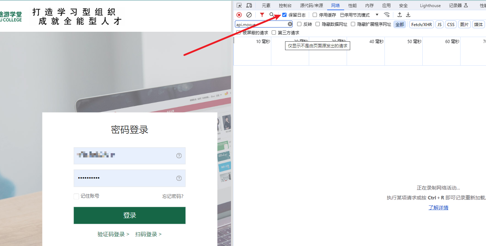
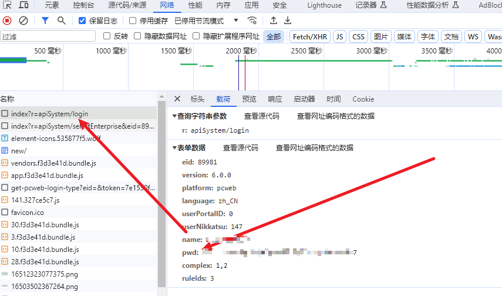
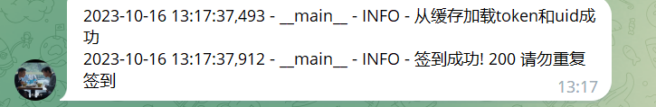

# 魔学院自动签到
自动签到[魔学院](https://www.moxueyuan.com/) 开发的培训平台。
## getStart
1. `data_tpl.yaml` 改名成 `data.yaml`
2. 填写`data_tpl.yaml` 里账号和密码，密码需要自己抓取。  流程如下
   1. 打开开发者工具,登录一次,(打开保留日志选项，防止重定向跳转)
   2. 
3. 如需配置telebot，参考配置说明。
4. `pip install -r requirements.txt`
5. `python3 auto_sign_in.py`

## 最终效果

